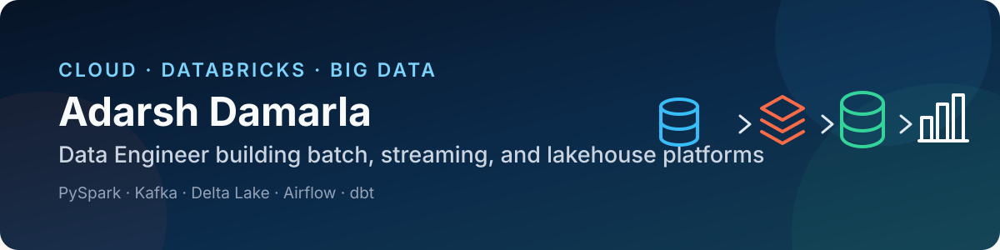
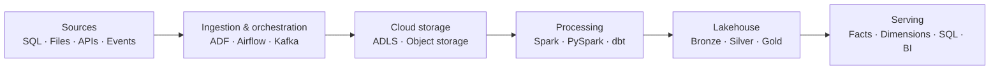

  

<h1 align="center">Hi, I'm Adarsh Damarla 👋</h1>

  <strong>Cloud & Big Data Engineer</strong> 
  Cloud Data Engineer building reliable batch, streaming, and lakehouse platforms that turn source data into analytics-ready models.

  
  

## About me

I design and build end-to-end cloud data platforms for reliable batch and real-time analytics using Azure, AWS, Google Cloud, Databricks, Spark, Kafka, Airflow, and dbt—from data ingestion and orchestration to governed lakehouse layers and analytics-ready models.

## What I build

- Metadata-driven ingestion from databases, files, APIs, and event streams
- Batch and streaming transformations with PySpark and Structured Streaming
- Governed Bronze, Silver, and Gold lakehouse layers using Delta Lake and Unity Catalog
- Incremental processing, CDC, and SCD Type 1/2 history management
- Cross-platform orchestration with Azure Data Factory and Apache Airflow
- Analytics-ready facts, dimensions, and serverless SQL datasets

## Featured projects

| Project | Engineering highlights | Stack |
| --- | --- | --- |
| [🎧 Spotify Azure Incremental Lakehouse](https://github.com/AdarshDamarla-DataEngineer-Git/Spotify-Azure-Project) | Metadata-driven incremental ingestion from Azure SQL to ADLS Gen2; Auto Loader processing; SCD Type 2 dimensions and a Type 1 streaming fact | ADF, ADLS Gen2, Databricks, PySpark, Delta Lake |
| [🚕 Real-Time Uber Ride Lakehouse](https://github.com/AdarshDamarla-DataEngineer-Git/Uber-Project) | Streams FastAPI-generated ride events through Event Hubs; unifies historical and real-time data; publishes an enriched OBT and SCD-managed dimensional model | FastAPI, Event Hubs, Structured Streaming, Lakeflow, Unity Catalog |
| [🌬️ Airflow + dbt + Databricks](https://github.com/AdarshDamarla-DataEngineer-Git/Airflow-DBT-Databricks) | Airflow 3 orchestrates Databricks ingestion and a dependency-aware dbt graph using deferrable execution and a containerized Celery platform | Airflow, dbt, Databricks, Celery, Redis, PostgreSQL, Docker |
| [🛰️ NASA GCN Fermi Streaming Pipeline](https://github.com/AdarshDamarla-DataEngineer-Git/Kafka-Databricks-Nasa) | OAuth-authenticated Kafka ingestion of NASA gamma-ray burst notices; native Spark parsing; governed analytical snowflake schema | Kafka, OAuth 2.0, PySpark, Databricks, Delta Lake |

### More portfolio work

- [E-commerce Databricks Pipeline](https://github.com/AdarshDamarla-DataEngineer-Git/Ecommerce-Databricks-Pipeline) — Six data domains processed through Bronze, Silver, and Gold layers with data-quality expectations, CDC, SCD Type 2, and dimensional modeling.
- [Olist Azure Big Data Platform](https://github.com/AdarshDamarla-DataEngineer-Git/BigDataProjects) — Approximately 1.56 million marketplace records ingested from HTTP, SQL, and MongoDB, transformed with PySpark, and served through Synapse Serverless SQL.

## Platform architecture

## Technical skills

### Cloud platforms

### AWS data services

### Google Cloud data services

### Azure data services demonstrated in projects

`Multi-Cloud Data Architecture` · `Cloud Object Storage` · `Managed Spark` · `Serverless Warehousing` · `Event Streaming` · `Metadata-Driven Ingestion`

### Databricks and distributed processing

### Streaming and orchestration

### Languages, databases, and modeling

`Medallion Architecture` · `Dimensional Modeling` · `CDC` · `SCD Type 1/2` · `Data Quality` · `Incremental Loading` · `Star/Snowflake Schemas`

## Currently strengthening

- Automated data testing, pipeline observability, and operational reliability
- CI/CD and environment-based deployment for Databricks and cloud data platforms
- Spark and Delta Lake performance tuning

## Let's connect

I'm interested in Cloud Data Engineer, Databricks Data Engineer, and Big Data Engineer opportunities where I can build reliable batch, streaming, and lakehouse platforms.

- Email: [d29adarsh@gmail.com](mailto:d29adarsh@gmail.com)
- Projects: [View all repositories](https://github.com/AdarshDamarla-DataEngineer-Git?tab=repositories)

---

<em>Designing reliable paths from source systems to analytics-ready data.</em>

